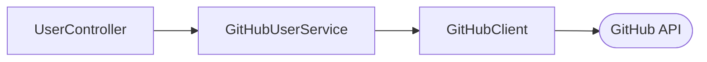

# Branch Exercise

This repo contains a small web application which performs a lookup for a GitHub user and their repos.

## Architecture

The codebase follows a 3-layer architecture where presentation, business, and data logic have their own separate layers.
In the presentation layer, the `UserController` handles HTTP request/response logic. The `GitHubUserService` exists in
the business layer and is responsible for chaining API requests to GitHub for the user and their repo. Finally, the
`GitHubClient` resides in the data layer and performs the requests to GitHub's API and handles any potential responses.



By following a 3-layer architecture, one layer's implementation details are abstracted away from the other layers. This
allows for loose coupling between components and makes the code easy to modify in the future.

## Setup

This project uses Gradle to build and run the application.

### Build

To build the application, run the following command from the project root directory: `./gradlew build`.

### Run Tests

To run the unit tests, run the following command from the project root directory: `./gradlew test`.

### Run Application

To run the application, run the following command from the project root directory: `./gradlew bootRun`. This will start
the application web server on port 8080 by default.

Once the application is running, you can query for users via the `/api/users/{username}` endpoint:

```
curl -X GET --location "http://localhost:8080/api/users/octocat" \
    -H "Accept: application/json"
```
